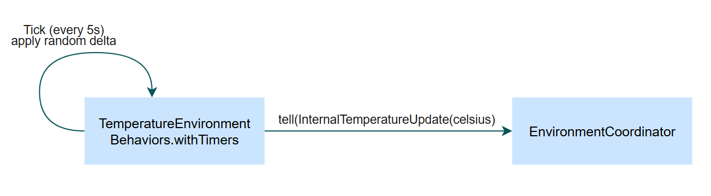
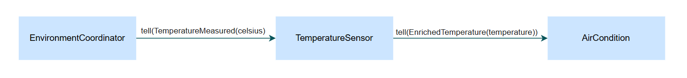
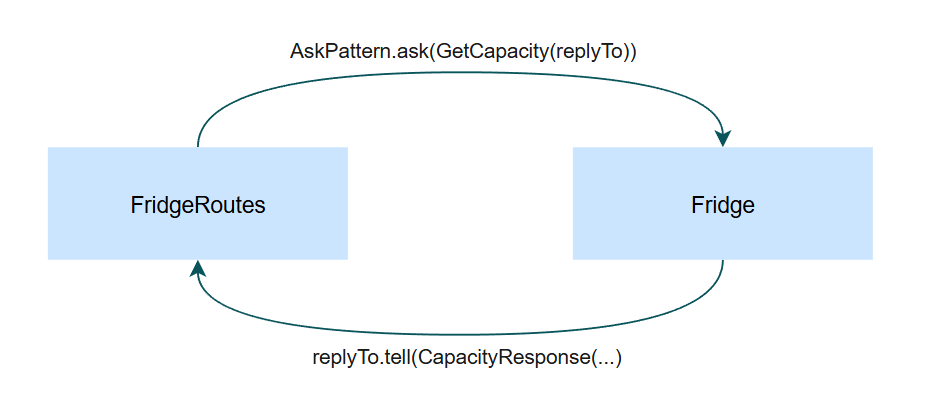
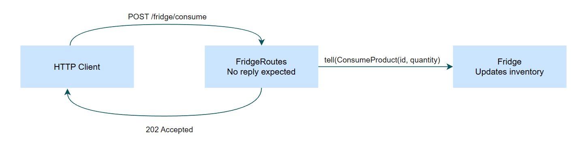
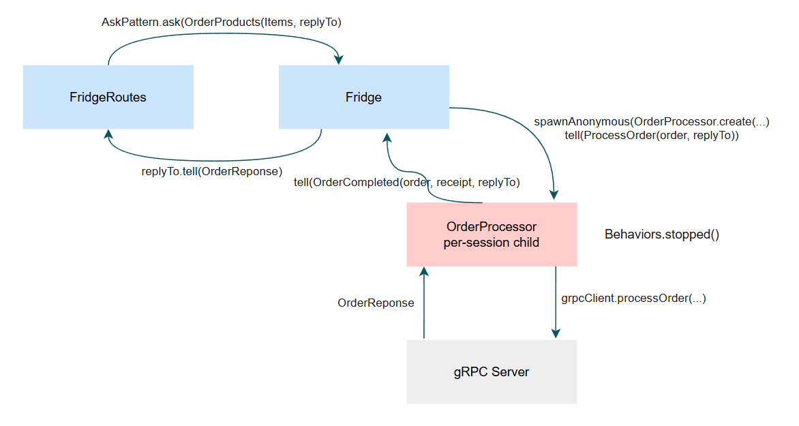

# Interaction Patterns

---

## 1. Scheduling Messages to Self
An actor uses a timer to send messages to itself periodically.

**Used in:**

- `environment/TemperatureEnvironment`: the internal temperature simulator sends itself a tick every 5 seconds and nudges its simulated temperature by a small random amount.
- `environment/WeatherEnvironment`: same idea, for the weather condition.

**How it works:**

When a Tick arrives, the actor adds a small random delta to the current temperature and pushes the new value to the EnvironmentCoordinator 
as an `InternalTemperatureUpdate`.

The temperature drifts gradually over time. 
No extra thread is needed. Pekko's scheduler handles the timer. When the actor stops, the timer is cancelled automatically.

---

## 2. Fire and Forget (Tell)

A message is sent without expecting a reply.

**Used in:**

This is the most common pattern in the system. It is used everywhere where a reply wouldn't add anything. A few examples:

1. EnvironmentCoordinator -> TemperatureSensor: TemperatureMeasured
2. EnvironmentCoordinator -> WeatherSensor: WeatherMeasured
3. TemperatureSensor -> AirCondition: EnrichedTemperature
4. WeatherSensor -> Blinds: WeatherUpdate
5. MediaStation -> Blinds: MovieStatusChanged
6. MqttEnvironmentClient -> EnvironmentCoordinator: MqttTemperatureUpdate / MqttWeatherUpdate

Sensors broadcast their measurements to the actuators that need them. 
A reply like "AC got the update" wouldn't mean anything. There's nothing the sensor would do with it. The same holds for coordinator-to-sensor messages.

---

## 3. Request-Response with Ask (between Actor and HTTP)

A caller sends a request and waits (with a timeout) for exactly one reply. The reply address is included in the request itself.

**Used in:**

Everywhere the HTTP routes need data from an actor to put into an HTTP response.

Example: /status aggregates four actors in parallel.
Each actor receives a `replyTo: ActorRef<...Response>` in its request message. 
HTTP is synchronous. The client is waiting for an answer. 
So we need exactly one Future per actor call, with a timeout. 
Ask gives us that timeout for free and creates a short-lived internal adapter actor that receives the reply. 
This is the right fit whenever the HTTP layer needs a snapshot from an actor.

---

## 4. Send Future Result to Self (pipeToSelf)

An actor calls something that returns a CompletionStage (like a gRPC client) and wants to handle the result as a normal 
Pekko message. Inside the actor, not inside a future callback.

**Used in:**

devices/OrderProcessor.java. 
The per-session child calls the gRPC client. When the response comes back, we want it to flow through the actor's mailbox like any other message.

**How it works:**

`pipeToSelf` turns a CompletionStage into a message that arrives at the actor's mailbox. 
The `CompletionStage<OrderResponse>` from the gRPC call is wrapped into either a `GrpcResponse` (on success) or `GrpcFailure` (on error) and sent to self. 
From there everything continues normally: gRPC success -> build the receipt -> tell the Fridge.

The alternative is calling the gRPC client and handling the result inside the future's callback. This would break the actor model. 
That callback runs on a different thread, so touching the actor's internal state from there is not safe.

---

## 5. Ignoring Replies (Tell without replyTo)

Like fire-and-forget, but used in places where a reply could technically exist. We just don't want one.

**Used in:**

- `Fridge.ConsumeProduct`: the user clicks "Consume", the HTTP route does a tell(...) to the Fridge and immediately answers the HTTP request with 202 Accepted. There's no replyTo on the command.
- `Fridge.OrderProducts.autoOrder(...)`: when a product hits zero, the Fridge sends itself an order. The replyTo field is `Optional<ActorRef<...>>` and is empty in this case (see Design Decision 9 in the README).

In the response handler, the optional replyTo is handled with `ifPresent(...)`. If it's empty, no reply is sent.
"Consume" is a pure command. There's nothing meaningful to return. The auto-order case shows how the same command can work with or without a reply.

---

## 6. Per-Session Child Actor

An actor spawns a short-lived child for each request. The child holds the state for that one request and stops itself when done.

**Used in:**

`Fridge.onOrderProducts`: for every incoming order, a new OrderProcessor is spawned as an anonymous child.

**Fridge side:** one new child per order.
**Child side:** stops itself after sending the reply (`Behaviors.stopped()`).

**Why it fits:**

- It's required by the assignment.
- Each order has its own state (which order, who's waiting for the reply). If we kept that in the Fridge instead, we'd need a `Map<OrderId, replyTo>` that grows with every order and that we'd have to clean up by hand. The per-session child holds that state on its own and disappears when the order is done.
- gRPC is asynchronous. The child can wait for the response without blocking the Fridge. Multiple orders can be processed in parallel without any extra effort.
- When the order finishes (success or failure), the child returns `Behaviors.stopped()` and is cleaned up. No memory leak.

---

## 7. Receptionist (Service Discovery)

Actors register under service keys. Other actors subscribe to those keys and get notified automatically when actors register or unregister.

**Used in:**

Every inter-actor relationship in the HomeAutomationSystem, except the per-session children of the Fridge:

- `EnvironmentCoordinator` subscribes to `TemperatureSensor.SERVICE_KEY` and `WeatherSensor.SERVICE_KEY`
- `TemperatureSensor` subscribes to `AirCondition.SERVICE_KEY`
- `WeatherSensor` subscribes to `Blinds.SERVICE_KEY`
- `MediaStation` subscribes to `Blinds.SERVICE_KEY`

**Why use it instead of passing references via the constructor:**

- No spawn-order dependency. Actor A can exist before actor B, without needing a reference to B at startup.
- A second AC or a second Blinds could be added later without changing any sensor code.

Pekko only allows one messageAdapter per message class per actor. The EnvironmentCoordinator gets around that with a single shared adapter that checks `listing.isForKey(...)` (See Design Decision 3 in the README).

---

## 8. gRPC Bridge between Two Actor Systems

Two independent ActorSystems talk to each other through a strictly typed request-response protocol.
The bridge connects the HomeAutomationSystem (Fridge and its per-session OrderProcessor children) with the OrderProcessorSystem (OrderServiceActorImpl).

**Schema:** `src/main/proto/orderprocessing.proto`

**Client side (HomeAutomationSystem):**

The gRPC client is created once in the controller and passed down to the per-session OrderProcessor children (no new channel per order). 
The child calls `grpcClient.processOrder(...)` and turns the future into a self-message with pipeToSelf (see Pattern 4).

**Server side (OrderProcessorSystem):**

OrderServiceActorImpl implements the generated OrderService interface. 
Incoming gRPC calls are forwarded into the actor system via `AskPattern.ask` to the ValidationActor. 
From there the call flows through the actor pipeline (Validation -> Persistence) and the result is sent back as the gRPC response.

**Why?**

- Pekko gRPC generates the server and client stubs from the `.proto` file. We don't have to write any serialization or deserialization code.
- The two systems are only coupled through the `.proto` schema. They can be started, deployed and updated independently.